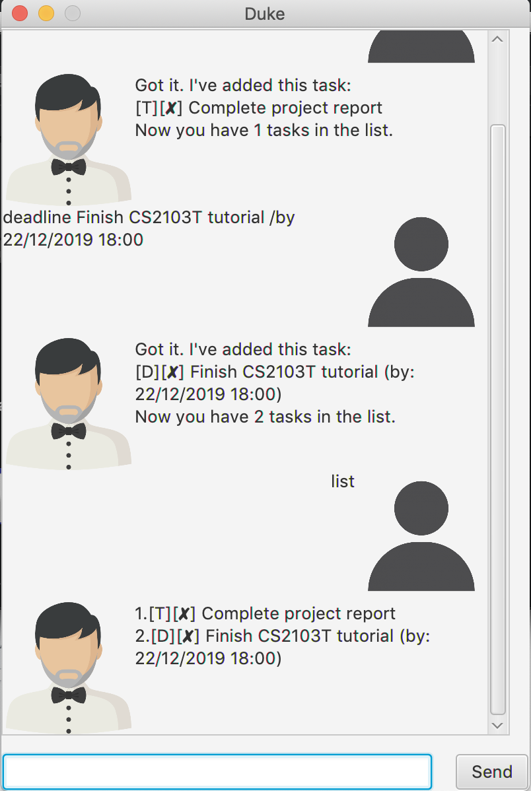

# Duke User Guide

## User Interface


## Features 

### Task Management
Duke is a task management program - It allows the user to manage their daily tasks efficiently. This includes creating,
updating, deleting and searching for tasks.

## Usage

### 1. `todo`

The `todo` command allows the user to create new todo tasks without a start or end date.
The format of the command is `todo <task description>`

**Example of usage:**

`todo go for a haircut`

**Expected outcome:**

```
Got it. I've added this task:
[T][✘] go for a haircut
Now you have 1 task in the list!
```

### 2. `deadline`

The `deadline` command allows the user to create new tasks with deadlines.
The format of the command is `deadline <task description> /by <deadline in DD/MM/YYYY HH:mm>`

**Example of usage:**

`deadline finish project report /by 12/09/2019 22:00`

**Expected outcome:**

```
Got it. I've added this task:
[D][✘] finish project report (by: 12/09/2019 22:00)
Now you have 2 tasks in the list!
```

### 3. `event`

The `event` command allows the user to create new tasks with a start and end date & time.
The format of the command is `event <task description> /at <start in DD/MM/YYYY HH:mm> /to <end in DD/MM/YYYY HH:mm>`

**Example of usage:**

`event go for lecture /at 12/09/2019 12:00 /to 12/09/2019 14:00`

**Expected outcome:**

```
Got it. I've added this task:
[E][✘] go for lecture (from: 12/09/2019 12:00 to 12/09/2019 14:00)
Now you have 3 tasks in the list!
```

### 4. `done`

The `done` command allows the user to mark existing tasks as completed.
The format of the command is `done <index of task to be marked as completed>`

**Example of usage:**

`done 2`

**Expected outcome:**

```
Nice! I've marked this task as done:
[D][✓] finish project report (by: 12/09/2019 22:00)
```

### 5. `delete`

The `delete` command allows the user to delete existing tasks.
The format of the command is `delete <index of task to be deleted>`


**Example of usage:**

`delete 1`

**Expected outcome:**

```
Noted. I've removed this task:
[T][✘] go for a haircut
```

### 6. `list`

The `list` command allows the user to see a list of existing tasks.

**Example of usage:**

`list`

**Expected outcome:**

```
1.[D][✓] finish project report (by: 12/09/2019 22:00)
2.[E][✘] go for lecture (from: 12/09/2019 12:00 to 12/09/2019 14:00)
```

### 7. `find`

The `find` command allows the user to see a list of existing tasks related to a keyword.
The format of the command is `find <keyword>`

**Example of usage:**

`find lecture`

**Expected outcome:**

```
1.[E][✘] go for lecture (from: 12/09/2019 12:00 to 12/09/2019 14:00)
```

### 8. `bye`

The `bye` command causes the Duke program to exit.

**Example of usage:**

`bye`

**Expected outcome:**

`Bye. Hope to see you again soon!`